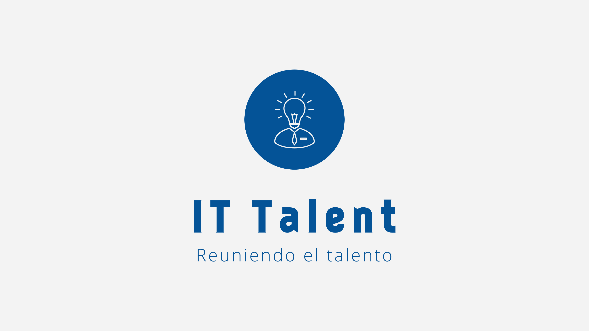

# IT-Talent

1. Objetivo de la App
2. Descripción
3. Justificación técinica
4. Credenciales de acceso
5. Dependencias

## 1. Objetivo de la App

IT Talent proporciona una plataforma al alcance de la mano para reclutamiento de talento para vacantes en el área de Tecnologías de la Información. Acoplandose perfectamente a los procesos de reclutamiento para puestos de trabajo remoto/hibrido y facilitándolos.

En IT Talent los reclutadores pueden:

- Publicar vacantes de empleo.
- Administrar las etapas de los proceso de reclutamiento publicados (Publicación, revisión de candidatos, Entrevistas, Evaluaciones, Finalización), con el objetivo de tener un mejor acercamiento y feedback con los candidatos.
- Tener acceso directo a la información profesional y de contacto de los candidatos para encontrar los mejores talentos.

En IT Talent los profesionales de TI pueden:

- Exponer su perfil profesional (CV digital) a los reclutadores.
- Encontrar las mejores ofertas para el rol profesional que ejercen.
- Aplicar a ofertas de trabajo y ver su claramente su avance en el proceso de reclutamiento, así como tener contacto con la persona encargada del reclutamiento. Así mejorando su experiencia al buscar empleo en TI

## 2. Descripción

**Visuales IT Talent**

IT Talent se compone visualmente de tonos Azul que, según la psicología del color, denota profesionalidad, hace ver serias las cosas, además emite sinceridad y calma. Con toques terciarios de amarillo-naranja para meter positividad, modernidad, luminosidad e innovación, buscando eso, crear un espacio amigable, cómodo, innovador, moderno, que cumpla con la mayoría de recomendaciones y estándares de UI/UX para reunir y conectar personas llegando a mejorar la experiencia de la empleabilidad en el área de las tecnologías de la información.

Hablando del logo elegido, para este se ideo un diseño simple el cuál se comprende totalmente del color primario para generar presencia y no perder elementos del mismo añadiendo más colores.

[Más información de la propuesta visual](https://github.com/MauriciioGS/IT-Talent/blob/master/propuesta-visual/Propuesta%20visual%20IT%20Talent.pdf)

### [UIKit y Mockups](https://www.figma.com/file/a0kU68Db5N5UUVQri6ZeDc/UI-KIT-PROYECTO-ITTalent?node-id=301%3A3534&t=XWvh4krkFW9qKh1n-1)

## 3. Justificación técnica

IT Talent ofrece múltiples listados de contenido y está orientado únicamente a smartphones buscando un acercamiento rápido e inmediato entre talentos y reclutadores. Dado que la app gira en torno a las listas, la única orientación permitida es la "portrait" para una mejor experiencia visual. Claro que, a futuro se tiene contemplado mejorar la compatibilidad responsiva para iPad y cualquier orientación.

La App tiene como mínimo soporte iOS 14. Se han buscado API's no tan antiguas por la utilización de algunas bibliotecas con métodos cruciales deprecados en versiones anteriores a la elegida. Viendo esto por el lado del público objetivo, se tiene que la comunidad "Tech" o "IT" son entusiastas tecnológicos que aspiran a tener dispositivos modernos, es por ello que IT Talent apunta a versiones más recientes.

## 4. Credenciales de Acceso 

- Usuario Reclutador: correo1@correo.com, password: 123456
- Usuario Talento: mauricaz@outlook.com, password: 123456

## 5. Dependencias

- Lottie: biblioteca para android de Design Barn Inc. que permite implementar animaciones en la UI a partir de archivos JSON descargados desde el sitio oficial de LottieFiles.
- CoreData: para tener persistencia de datos locales. Poder crear bases de datos sencillas que ayuden a recuperar datos, por ejemplo del usuario, inmediatamente.
- Firebase Firestore: como solución al Backend se implemento esta base de datos No-SQL que proporciona Google como servicio para crear colecciones y documentos, actualizarlos, consultarlos y eliminarlos.
- Firebase Auth: para agregar autenticación a la aplicación de manera sencilla utilizando el servicio de Google Firebase, únicamente se implementa la autenticación con correo y contraseña.
- Firebase Analytics: para que se envíen datos sobre el uso de la app en los dispositivos que la instalan y ver un análisis de dichos datos en la consola de Google Firebase.
- Firebase Firestore Swift: esta es una bibliteca para utilizar los servicios de Firebase Firestore con la sintaxis y funcionalidades de Swift como son la closures.